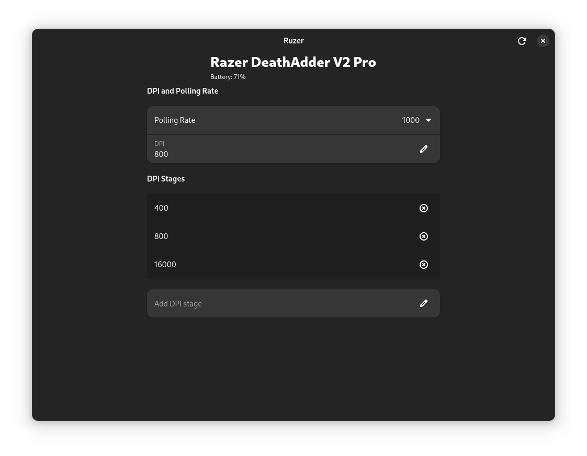

<div align="center">

<h1>Ruzer (Work in Progress)</h1>

</div>

**Ruzer** is a Rust-based userspace library and GTK4 application for managing
Razer mice — no kernel driver required. Inspired by OpenRazer, but designed to
be simpler to install and use (no dkms or akmods, just install an app).

Due to not using a kernel driver, the mouse may freeze for a couple seconds after
applying changes.

## Features
### ✅ Current
- Configure DPI
- Set polling rate
- Manage DPI stages
- Battery level and charging status reporting
### 🔜 Planned
- RGB customization

## Notes
- Still a Work in Progress
- Only tested with a single Razer mouse. More mouse support will be added, but I can't test them — contributions and testing with other devices are very welcome!

## Getting Started
Clone the repo, build, and run with Cargo:

Then run
```bash
cargo run --release
```

## Special Thanks
Thanks to the [OpenRazer](https://github.com/openrazer/openrazer) project for
their reverse engineering efforts of the Razer protocol.

---

## Supported Devices
|            Device                |    Status    |
| -------------------------------- | ------------ |
| Razer DeathAdder V2 Pro Wireless |      ✅      |
| Razer DeathAdder V2 Pro Wired    |      🟨      |

✅ = Supported, tested

🟨 = Supported, not tested
